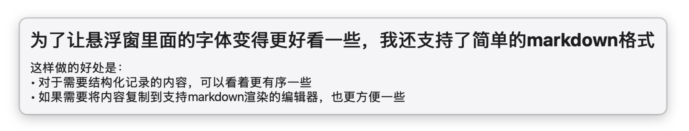
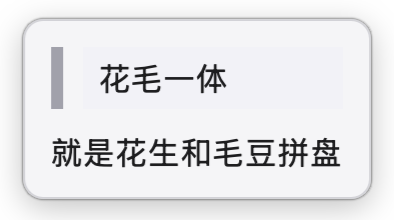

> 必须承认，这个应用的思路~~借鉴~~致敬了Snipaste

**下载地址：** https://github.com/NielsLee/FloatDraft/releases

让我产生做这个应用的场景，一个是在日常工作中。在企业微信/IDE/网页等等窗口之间提取信息的时候，经常会遇到一个场景：提取到的信息复制到了粘贴板里，但是紧接着又要复制下一个信息了。这个时候我便不得不随手打开输入工具，如SublimeText。如果实在着急，在企业微信里面随便找一个人的聊天窗口把内容复制进去也行（最好不要找老板或者群聊，失手发出去了就会很尴尬）。于是我萌生了一个想法：**能不能在电脑上做一个类似于“草稿本”的工具，让我能够随手将我的想法，信息记录在上面？** 

除此之外，在我业余浏览学习一些东西的时候，也会遇到一个场景：新名词太多，阅读过程中经常要反复查阅资料/AI，这种时候，我就会特别希望能**有一个便签一样的工具，把这些新名词”贴“在屏幕上面**，帮助我更好地学习新内容。

除了直接创建一个空的编辑窗口之外，我还支持了通过F5快捷键，从剪贴板中快速创建一个编辑窗口，对于上述提到的第二个名词解释的场景，会比较有帮助。

目前使用下来，体验还不错，第一个使用场景的需求基本得到了满足。针对第二个场景，使用下来会遇到一些问题：有些时候阻碍我学习的，并不是已知的名词能否被记录在屏幕上，而是位置的名词能否得到快速的解释。这种场景下，更有帮助的形态可能是：快捷地呼出一个AI对话框，针对输入的内容或者选中的内容，生成一段快速的解释，然后留在屏幕上。
