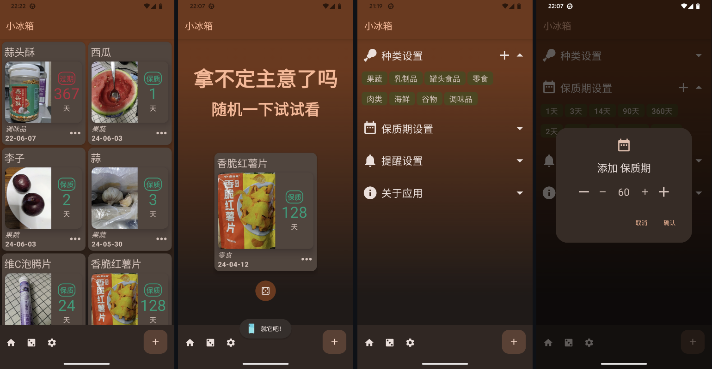

## 先放链接
[Github仓库](https://github.com/NielsLee/FoodRecords)

[FDroid下载](https://f-droid.org/packages/lying.fengfeng.foodrecords/)

[少数派APP推荐🎉](https://sspai.com/post/90287)

## 背景
最初是从小红书上看到有人做类似功能的一个小程序，然后得到了灵感。我感兴趣的点到不是它的功能，我一个学生时代笔记都懒得做的人，怎么可能会在成为打工人以后记录这些东西（*苦笑.jpg*）；我感兴趣的是它实现起来并不复杂，而我那个时候刚好想做一个APP练练手。于是就决定是你了，Fridgey！

## 开发
使用Compose开发界面，刚上手的时候还是很爽的，觉得自己真的像一个composer在谱曲一样；不过当界面复杂起来的时候，写代码的难度就会上来一些，因为要用大量的控制变量来控制组件的状态。不好说和传统的XML比起来谁更好一些。*（毕竟也不是很复杂的项目）*

## 成果

> *请忽略这个奇怪的颜色，它并不代表个人审美，完全是由M3自动取色+暗色模式生成的；大部份情况下，它的颜色还是很漂亮的😳*

作为第一个Github项目、第一个独立开发并上架Fdroid的应用，小冰箱对我的意义还是很重大的🥳！应用上架以后陆续收到了很多用户的邮件和issue反馈 *（虽然大部份都是功能需求，但是几乎每个人都会在邮件里对应用表示喜欢和感谢，这种成就感是平常的工作很难享受到的，这就是所谓的良言一句三冬暖吧）*

而且，在更新了几个版本后，小冰箱意外地被少数派收录到了【近期APP推荐】栏目。我原本以为这个栏目里面的APP是需要投稿才会收录的，没想到他们真的会自己去搜索APP并且拿来使用和评测。虽然评论区有不少人说它有点华而不实、使用成本高，但是自己的作品能够被大家花费时间和精力拿来讨论，已经是一件很厉害的事情了吧^_^
