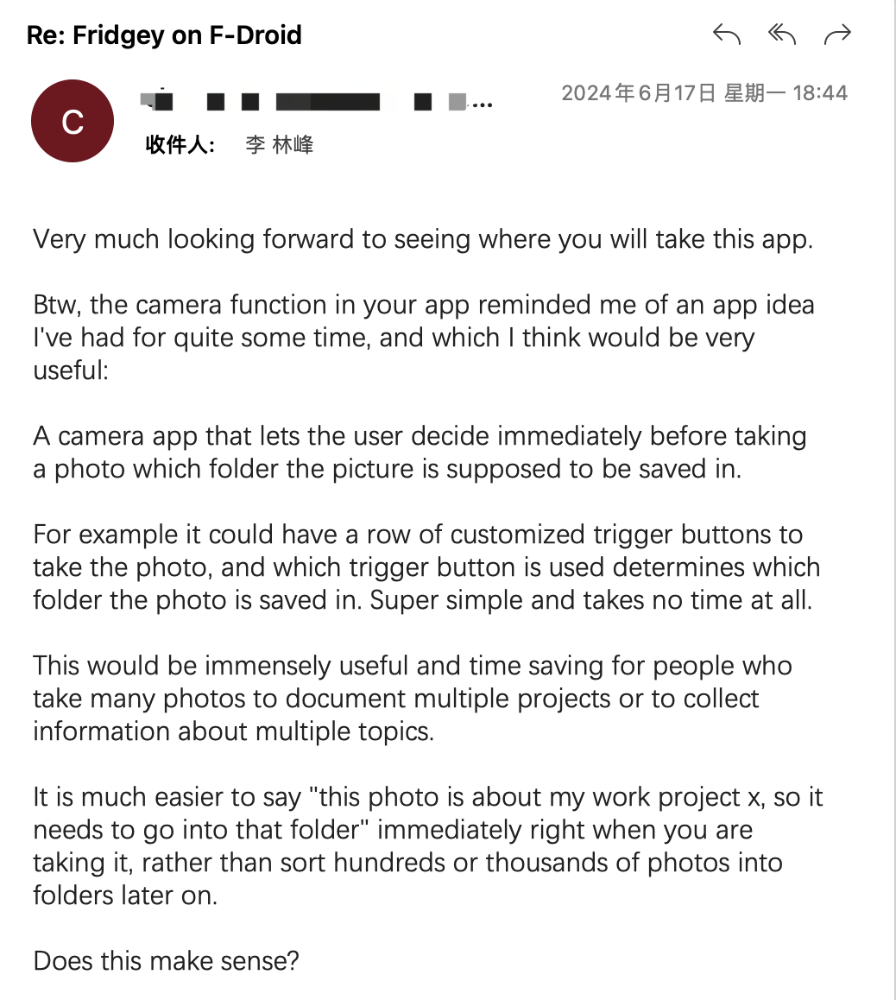

## 先放链接
[Github仓库](https://github.com/NielsLee/SnapSaver)

[FDroid下载](https://f-droid.org/packages/lying.fengfeng.snapsaver/)
## 背景
这是我做出来的第二款APP；在第一款小冰箱上架FDroid以后，我收到了一位用户的邮件；他在邮件里面点评了一番小冰箱以后，提出了另一个想法：

收到这封邮件的时候，我的心情是WoW的；一来他为我做的下一个app提供了思路，二来我认为他这个想法真的很棒；虽然我没有这样的使用场景，但是他所描述的方案是我想到的在这种场景下的最佳的解决方案了。于是我很快就决定按照他提出的思路做一个这样的APP出来。

## 开发
一旦开始自力更生开发移动应用，跨平台框架的优势就体现出来了：能用一套代码+一些适配工作量就可以让自己的应用多一个平台运行，何乐而不为呢？什么你说后期维护？拜托，先做出来再说👋～

所以我就这么创建了我的第一个Flutter项目，一边对着ChatGPT输出一边朝着目标迈进。Flutter给我的第一感觉是：**真TM乱**；可能是因为我刚刚用完Compose，觉得声明式UI的代码就是应该简洁明了，结果Flutter就给了我当头一棒；相比于Compose，我觉得Flutter里面有一些点我用着很不习惯：
1. Widget之间的嵌套要么需要return，要么需要放进数组；声明了，但是没完全声明，代码之间还是揉在一起的
2. Dart不是JVM语言，对于Android开发者来说入门需要一些学习门槛
3. 一切皆Widget不是开玩笑的；连调整边距、调整位置这些功能都需要嵌套一个Widget来实现🤷（在Compose里面就是modifier一个方法的事）

不过还好有GPT老师在，让我在一知半解的情况下还是把这个应用给做出来了。**再一次感叹，人工智能大幅提升了程序员的下限。**

## 成果

嗯。。。看起来挺简陋的，不过核心功能已经具备了；接下来要做的一个是把一键导入所有相册的功能实现了，再一个就是细化一下选择路径的功能，以及把IOS端也做出来（给自己挖的坑越来越多了）；这个APP让我有点纳闷的是：上架五天了，居然只在Github收到一颗星💢。我对它的预期是比小冰箱要高的。估计是因为它的功能太小众了，毕竟人人都要吃东西，但是不是人人都有分类照片的需求。