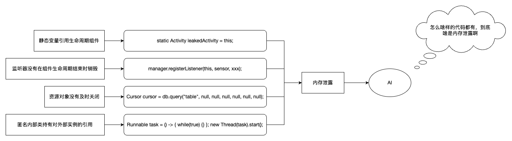
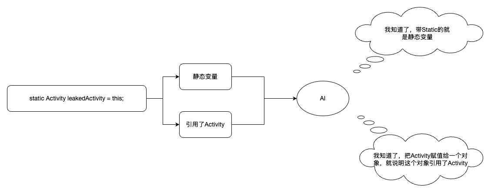
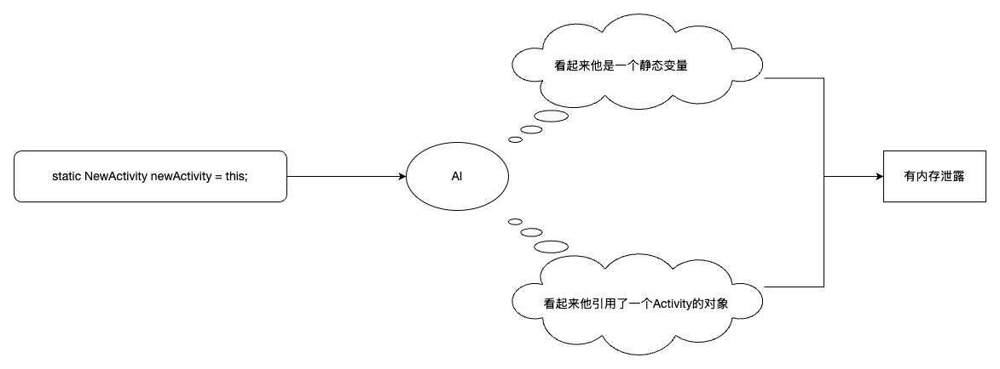
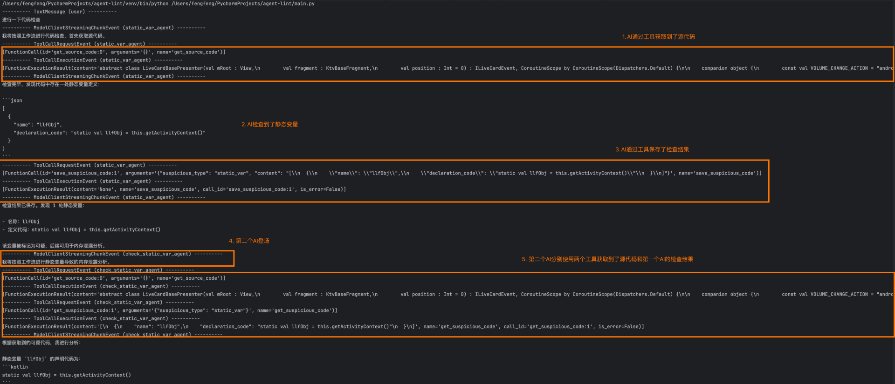
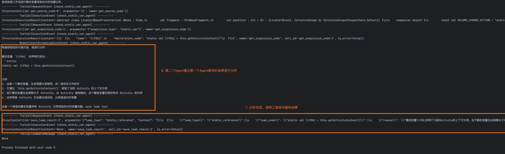
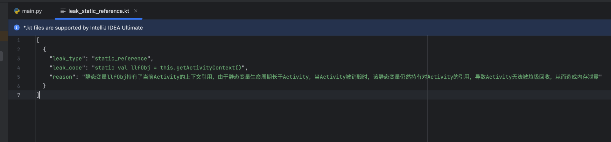
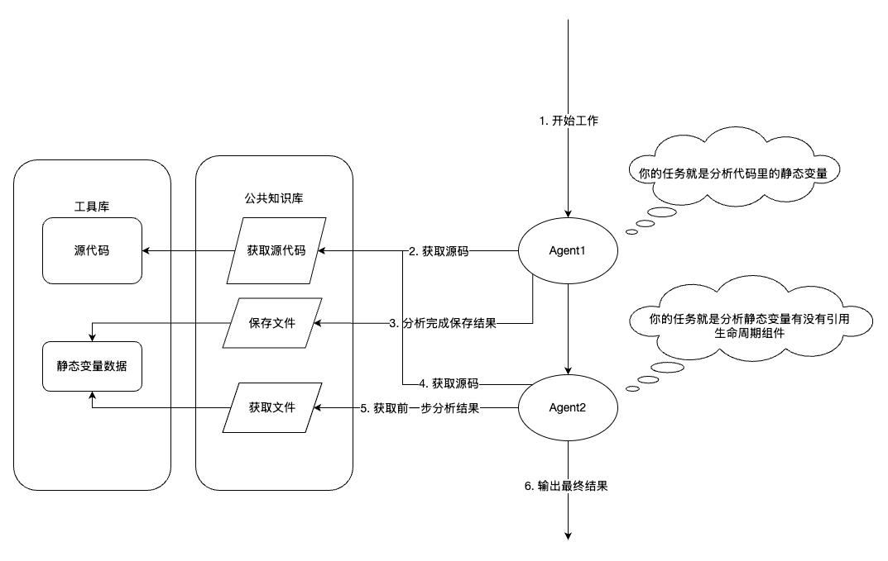

# 题外话
《人类简史》里面提到了这样一个观点：智人之所以能够统治地球，是因为智人是唯一一个“能够大规模灵活地合作的物种”。在完成了认知革命以后，人类具备了“想象并相信并不存在的事物”的能力，于是诞生了宗教、社会乃至后续的企业、国家、民族等等事物。借助这种能力，人类可以在大范围内开展分工合作，进而完成过去单打独斗时代无法完成的事情。作者着重强调了分工合作的重要性，认为人类社会能取得今天这样伟大的成就，其根源就在于此。


我们想要理解这个观点不难，因为我们已经生活在了一个处处都在分工合作的社会。我们不需要掌握种植或者养殖技巧就可以获得食物，不需要会开车就能使用交通工具等等。反倒是由于分工合作已经深入到了人类社会的方方面面，导致我们反而不清楚自己在集体的分工合作中处在一个什么样的位置，不清楚自己到底为社会中的其他角色贡献了什么；当我们把目光转向集体（比如国家，公司）取得的成就的时候，我们往往感到诧异：我每天做的这些简单重复的事真的能带来这样的结果吗？答案是肯定的：是的，这恰恰就就是分工合作的目的。每个个体专注做最简单最基本的事情，却能让集体完成在每个个体看来都无法完成的任务。


#  插上想象的翅膀
上面这段不是我们今天的主题，只能算作一个引子。自从大模型AI进入了公众视野以来，人们做出了许多让大模型变得更加智能的尝试，譬如不断提高模型的推理能力，创造出更“聪明”的AI；或者是不断完善prompt，寻找与AI对话的更好的方式，再或者推广MCP协议，让AI更多地与现实世界建立联系。但是我一直存在一个疑问：既然目前的大模型已经足够智能到近似一个有思想的个体，那么我们是否可以尝试让大模型之间像人类一样分工合作起来呢？为此我们做一个这样的表格，来把目前AI遇到的问题在人类社会中寻找对应的关系，看看能否得到一些解决方式：

|   |   |   |   |
|---|---|---|---|
|人类|人类的解决方式|AI|AI可能的解决方式|
|一个人的能力有限，只能专注于有限的事情|分工合作，每个人做简单重复的工作，借助集体的力量完成大事|大模型的上下文有限，无法处理太长的信息|在每个AI Agent之间建立分工合作体系，每个Agent专注细分的工作|
|人类的力量有限|使用工具来完成人类本身不能完成的事情|大模型只能生成内容，在专业领域能力受限|借助MCP协议拓展Agent的能力|

这个表格看上去很合理，接下来我们需要的就是通过一些尝试来验证这个方向的可行性的。其实在我产生这个想法并且上网寻找资料时候，就发现已经有公司推出了这个方向的产品级应用了，像是CrewAI，ChatDev这种，这恰恰说明了这个方向是可行的。我一个人很难通过构建产品级的应用来验证自己的猜想，但是我可以从日常工作里面寻找case，然后尝试通过上面的思路来构建一个AI应用，看看效果是否优于传统的AI应用方式。

# 回到现实

正如我的企微名片上写的，我所在的小组是专项测开组，日常工作是开发一系列工具来完成测试领域的效能提升。最近组里接到这样一个需求：**通过AI来完成对代码可能存在的内存泄露问题的检测**

这项工作可以做的很简单：把代码丢给AI，加上一段类似“请帮我检查这段代码中是否存在内存泄露xxx”提示词，然后拿到结果。但是不用说你们也知道这样做的结果是什么：AI一通胡编乱造。这种方法得到的结果完全不可用。哪怕在提示词中加入很多限制条件，AI还是难以做到准确。我们尝试从大模型生成内容的原理来分析原因：大模型是根据前面出现的词根，推理后面词根出现的可能性，然后选取最高概率出现的词根作为输出，进而得到生成的内容的。而“内存泄露”描述的是一个场景，而不是针对特定的代码。以Java为例子，当文本中出现“静态变量”的时候，对应的代码一定会有“Static”关键字，因此AI可以很准确地将“静态变量”与“Static”关联起来；但是“内存泄露”它是由更高级别的原因组成的一个结果，在AI的训练库中，它可能对应着毫无规律的代码，因此想让AI直接找到“内存泄露”的场景则变得十分困难。




**所以，我们要尝试将“内存泄露”这个结果拆分，拆分成“显而易见的原因”，然后再交给AI进行分析：**



当AI掌握了足够多的“显而易见的原因”以后，AI对原因的判断将会变得更加准确。当AI能够判断出原因以后，再让AI通过原因推理出结果，达成我们想要得到的目的。




这样，判断内存泄露这样一个抽象的结果的过程，就被分成了一步步进行的，提取特征的过程。那么既然这个过程是按次进行的，那么我们就可以尝试引入多个Agent，每一个Agent做其中一个步骤的工作，将结果传递给下一个Agent。这样就可以让每一个Agent专注于做更简单，更显而易见的事情，并且降低单个会话的token数量。

# 编码

这里介绍一下微软开源的[AutoGen框架](https://github.com/microsoft/autogen)，以下是微软官方对他的介绍：

> AutoGen is a framework for creating multi-agent AI applications that can act autonomously or work alongside humans.
> 
> AutoGen 是一个用于创建多智能体 AI 应用程序的框架，这些应用程序能够自主行动或与人类协同工作。

在我用下来，这个框架的核心优势在于：

● 支持Agent编排，允许用户创建自定义工作流，自定义流转条件等，让Agent按照预设的步骤工作

● 支持创建函数工具或Agent工具，可以很方便地与其他系统集成

● 兼容Ollama和OpenAI Api，不管是本地的Ollama模型还是API，都能轻松调用（也包括Venus提供的API，这点很棒）

接下展示部分关键代码，介绍一下如何以工作流的形式检查代码中由“静态变量引用生命周期组件”导致的内存泄露问题：

  

```python

# 1. 初始化模型 Client
cheap_model = ModelClient(
    model="cheap_model",
    support_function_call=True,
    support_json_output=True,
)

expensive_model = ModelClient(
    model="expensive_model",
    support_function_call=True,
    support_json_output=True,
)


# 2. 定义工具
def get_source_code(file_path):
    """
    读取指定文件的源代码
    """
    return source_code


def save_temp_result(result):
    """
    保存中间分析结果
    """
    return temp_file_path


def get_temp_result():
    """
    读取上一步保存的中间结果
    """
    return temp_result


# 3. 定义工具对象
get_source_code_tool = Tool(get_source_code)
save_temp_result_tool = Tool(save_temp_result)
get_temp_result_tool = Tool(get_temp_result)


# 4. 定义第一个 Agent：检查静态变量
static_var_agent = Agent(
    name="static_var_agent",
    model=cheap_model,
    tools=[
        get_source_code_tool,
        save_temp_result_tool,
    ],
    task="""
    1. 获取源代码
    2. 找出代码中定义或赋值的静态变量
    3. 按 JSON 列表输出：
       [
         {
           "name": "静态变量名",
           "declaration_code": "静态变量定义或赋值代码"
         }
       ]
    4. 如果没有结果，输出 []
    5. 保存分析结果，供后续 Agent 使用
    """
)


# 5. 定义第二个 Agent：判断静态变量是否导致内存泄露
double_check_agent = Agent(
    name="double_check_static_var_agent",
    model=expensive_model,
    tools=[
        get_source_code_tool,
        get_temp_result_tool,
    ],
    task="""
    1. 获取源代码
    2. 获取上一步识别出的静态变量
    3. 判断静态变量是否引用 Activity、Fragment、View 等生命周期对象
    4. 如果存在内存泄露，按 JSON 列表输出：
       [
         {
           "filePath": "文件路径",
           "checkerName": "static_ref",
           "method": "泄露代码",
           "line": 行号,
           "description": "泄露原因"
         }
       ]
    5. 如果没有结果，输出 []
    """
)


# 6. 构建工作流
workflow = GraphFlow()

workflow.add_node(static_var_agent)
workflow.add_node(double_check_agent)

workflow.add_edge(
    from_node=static_var_agent,
    to_node=double_check_agent,
)

workflow.set_entry_point(static_var_agent)


# 7. 启动工作流
result = workflow.run(
    task="检查文件 /path/to/your/code.kt 是否存在静态变量导致的内存泄露"
)

print(result)

```


在上面这段代码中，我们将内存泄露这样一个抽象的问题的一个原因拆分出来，并且更进一步拆分成“明显的特征组合”，即“静态变量”和“生命周期组件”；由于这两个特征在AI看来很好识别，因此可以大大降低AI幻觉的概率；接下来我们运行以下，看看输出结果如何（由于调试过程中代码在不断修改，所以输出结果中的一些内容和上面示例代码中存在差异，但不影响过程的理解）：




最终结果格式如下：



用图片展示上述工作流，是这样的：



# 总结

在经过一番尝试以后，使用上述方案的检测已经部署了一条蓝盾流水线，Agent脚本的代码也提交到了工蜂仓库：agent-lint。流水线目前处在试运营阶段，在这个过程中我们也发现了一些问题：

● Agent使用太多的话，会导致成本很高；如果是使用计费API调用模型的话，这一点一定要注意；毕竟代码长度属于不可控变量，万一突然来一个几千上万行的代码，成本一下子爆炸；

● 模型基本能力对框架的表现结果有很大的影响。有些模型连最基本的工作流都无法保证顺利完成，而有些模型则表现十分出色。目前我们使用的是智谱的

glm-4.6-fp8模型，效果不错，最重要的是便宜；

由于生成式AI的表现是很难以量化的，所以这套方案相比直接使用AI究竟带来了多少提升，我们很难精确给出。随着这个项目的继续运行，我们可能会发现更多让AI变得更准确的优化方案，也可能会发现这套方案更多的问题，甚至发现这套方案完全无法继续进行下去。不过问题不大，人类社会发展到现代的过程中，也存在着数不清的失败的尝试。跟那些事情一比，我这微小的工作能算得了什么呢；）