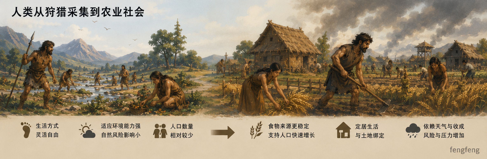
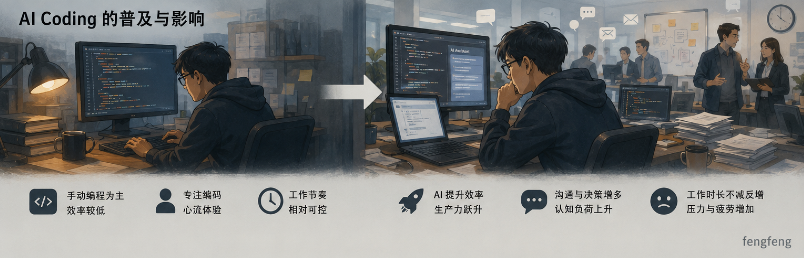
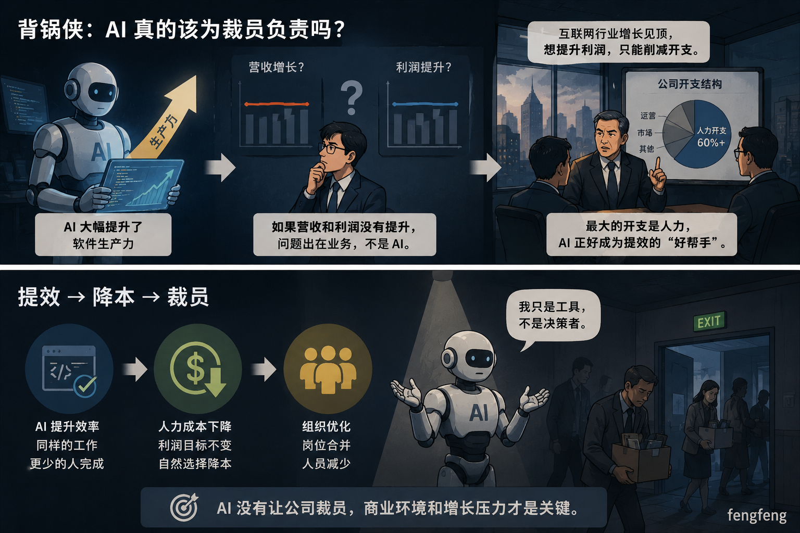
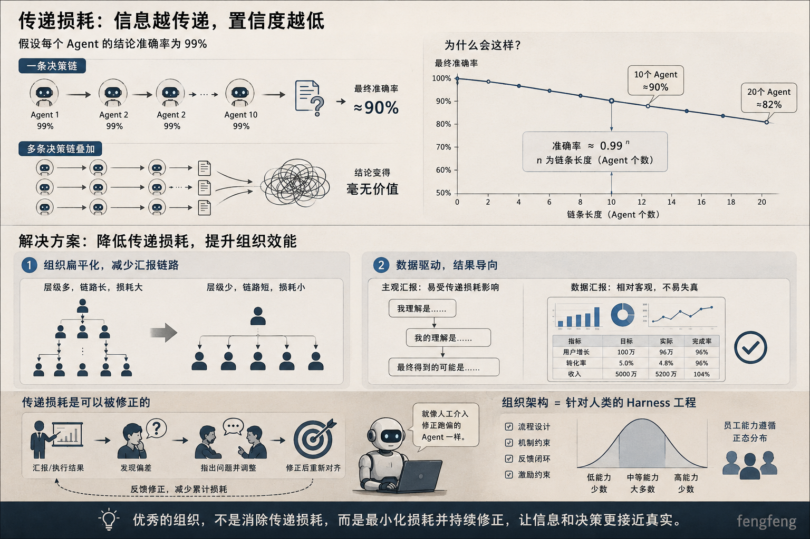

在今天这个时间节点，应该已经不会有人再否定AI对软件/互联网行业的影响了。大到企业经营方式，小到每一位工程师的日常工作流，影响都已经实实在在地发生。就我的体感而言，这个过程转变的时间节点刚好就是我跳槽到TME的时间。因此时至今日我在TME虽然只工作了一年半不到，但是回想入职之初和现在的工作内容，简直天差地别。

# 奢侈生活陷阱（Luxuxy Trap）
> 人类发明了农业之后，并不一定变得更幸福，但整个社会已经无法退回到狩猎采集时代。 -- 《人类简史》

人类在发明农业之前，主要通过狩猎和采集获取食物。这个阶段的人类不需要固定的住所，也不那么害怕极端的天气（相比于自己的农作物受天气影响颗粒无收而言，换一个根据地继续寻找猎物的代价显然是更低的）。在农业被刚刚发明的时候，人们无疑会感到幸福。幸福的点在于人们发现只需要守住自己的一亩三分地，就能源源不断地获取到粮食。这种开心带来的直接变化就是人类种群数量的扩大：农业带来了充足的食物，这些食物让人口数量暴增。但是随着人口数量增长到达另一个边界，人们发现农业社会也并没有当初想象的那么轻松：自己必须定居在农田附近了，不再像以前那样无拘无束；自己必须每天在田地里劳作；稍微遇到不好的天气，农作物减产，就会饿肚子甚至饥荒。针对人类社会中的个体而言，无法评判究竟是在狩猎采集时代过得更幸福，还是在农业时代过得更幸福。

但是人类还能回到狩猎和采集的时代吗？当然不能，因为那个时代的食物供应水平远远不如农业时代，不足以喂饱已经膨胀上去的人口，除非人类能劝说自己的一部分同胞自愿放弃生命以减少对粮食的需求（但这显然不可能）。看似是人类的聪明才智让社会生产力发生了进步，但是实际上人类并没有撤回这次进步的能力，因此人类更像是被“推着”进入了新的时代。

这个过程和AI Coding的普及过程太像了。在经历了长达一年的AI Coding之后，现在的程序员显然已经无法忍受当初古法编程的效率了。然而相比程序员本身，更加不能忍受的是他们的leader、leader背后的CEO、CEO背后的资本。AI Coding看似极大地解放了软件的生产力，但是解放的这部分生产力很快就被日常工作的沟通成本，不合理的试错需求填补进去。程序员的效率比原来快多了，但是工作时长不降甚至反增，每天工作时间的心情也从心流带来的愉悦变成决策疲劳。这个变化十分令人沮丧。

# 背锅侠
最近时不时地就会从媒体中得知xxx公司开启了裁员，多数这类新闻都会或多或少地将裁员和AI扯上关系。但是这个逻辑经不起细想：**AI能够大幅提升软件生产力这是不争的事实。如果生产力得到了提升，一家公司的营收和利润却没能因此提升，这明显是公司业务的问题，怪不到AI头上。** 很显然互联网行业已经走到了增长瓶颈，想要进一步提升利润，只有削减开支；互联网行业最大的开支就是人力开支，碰巧又来了AI这么个提效的好帮手；于是各大互联网大厂拿到AI的第一件事就是：提效、提效、再提效。

# 传递损耗
假设一个Agent给出的结论的准确率有99%，那么如果一条决策链条上有10个这样的Agent，上一个Agent给出的结论作为下一个Agent的输入条件，那么这条决策链最终的准确率就只有90%；如果多条这样的决策链叠加，给出的结论将变得毫无价值。
面对这种由传递损耗带来的置信度劣化的问题，人类给出的解决方案是：
1. 组织扁平化，减少汇报链路
2. 数据驱动，结果导向
这里的原因我理解一方面是降低顶层下发任务时候的传递损耗，让顶层的旨意能够正确地传达到执行层；另一方面是将执行层的成果使用一种相对不会发生传递损耗的方式来汇报，虽然数据统计口径是受主观影响的，但是数据本身很难说谎。

在这个链条中，还会存在一些修正的环节。比如某一次汇报中，听汇报的人发现结果和他的预期存在出入，他会在汇报中指出并且调整执行层的动作。这个过程就是一次“传递损耗修正”的过程。就像程序员发现Coding Agent在执行过程中跑偏了，会手工介入一样。可以说，组织架构就是针对人类的Harness工程。对于大企业来说，员工基数庞大，导致员工能力基本遵循正态分布（可能会因为行业不同导致基准有所不同），这种情况下企业方方面面的表现就和这些”人之外“的东西相关了。
