# 背景

研效平台2025年全年, 至2026年8月24日(统计日期), 所有登记在需求表格上的需求共计193条, 我们对这些需求按照类型进行分析后, 得到如下数据:
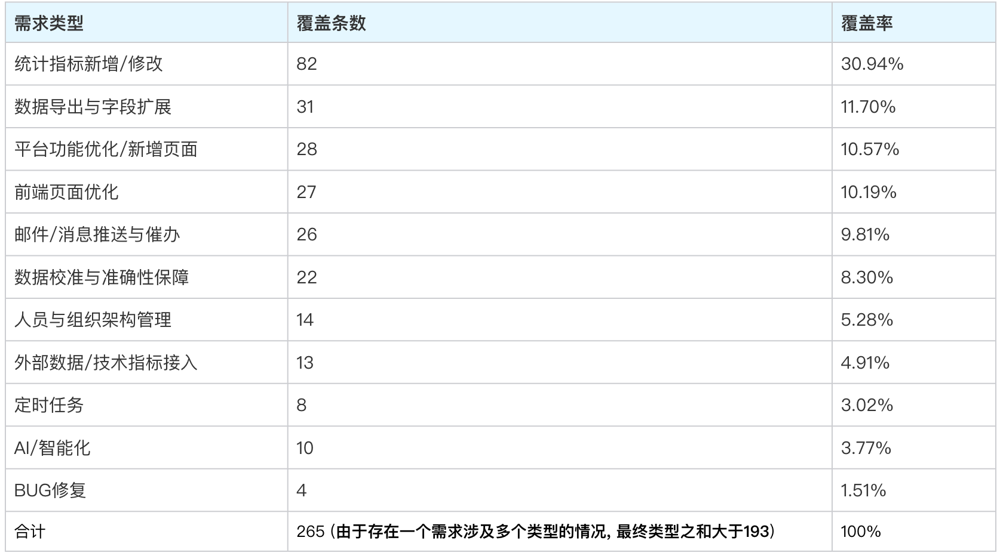
从价值角度而言, 我们应该按照需求分类的覆盖率从高到低, 来给出实现的优先级顺序; 但是考虑到交付MVP, 要确保产品必须是高度可用的, 因此需要对这些数据进行二次分类, 将现阶段能够使用最小成本完成AI闭环的类型提取出来; 对于什么样的需求可以使用AI闭环, 我们的定义是:

- 需求不涉及前端交互(现有Agent可以完成前端功能验证, 但无法代替人类完成交互验证)
- 需求不涉及外部资源(如对接Knot, 对接企业微信bot或者其他外部系统)

除此之外的需求, 完全可以让AI借助代码+测试环境数据实现逻辑修改+结果验证; 因此我们再将这些任务按照"可以直接通过AI完成开发+验证闭环"和"AI可以完成部分任务,但无法闭环"进行分类统计:
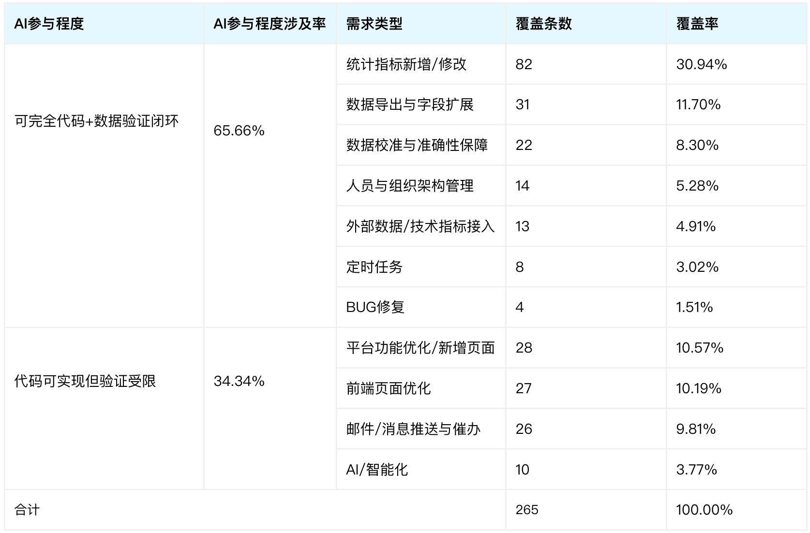
由此可见, 高达65%以上的需求可以通过AI实现修改+测试闭环

# 目标

- 需求实现, 降低开发需求需要的人力.

- 问题答疑, 数据校对实时响应, 从此不再当客服.
# 方案

## 自建的原因?

在设计方案之前, 我们调研了集团内部正在建设的一个AI Coding工程化项目Codelix, 看看能否解决我们的问题. 调研结果如下: 这个项目的设计思路是非常值得参考的, 尤其是在Agent调度这方面. 但是可惜的是, 这个项目诞生没过多久就成为了集团的明星项目, 来自不同部门不同模块的人从四面八方涌入, 导致这个项目越做越大, 功能越来越场景化, 越来越"重", 最终变得不再适合我们的内部服务场景了. 具体差异表现为:

|   |   |   |
|---|---|---|
|维度|业务产品(Q音, K歌等)|内部产品|
|澄清维度|澄清流程标准化, 有TAPD需求单做支撑|流程简易, 通常通过表格登记, 群聊沟通完成|
|开发维度|分端明确(客户端仓库, Web仓库, 后台仓库)|分端不明确, 以Web+后台为主, 无客户端|
|测试维度|测试依赖业务知识, 且客户端测试现阶段无法脱离人工验证|业务包袱轻, 仅仅依靠数据即可完成测试验证|
|运维维度|版本流程标准化, 依赖内部Devops工具|版本发布主打轻量高效, 通常由开发自行在服务器上完成|

因此, 对于我们内部工具产品, 使用Codelix会面临以下成本:

- 需求澄清成本增高, 从原来的表格登记, 变为使用TAPD跟踪;
- Codelix的开发是以单个仓库为工作区进行开发的, 对于内部工具产品来说过重, 内部工具产品完全可以将前后端仓库合在一个工作区进行开发;
- Codelix的测试依赖的流量平台, 自动化用例等平台, 是在功能需求的基础上搭建的, 内部工具产品接入也需要成本; 且对于内部工具来说, 只要通过数据验证即可完成绝大多数测试工作, 不需要那么重的流程
- Codelix部署版本对接的是运维平台, 对于内部工具来说同样太重; 内部工具往往只需要代码同步+数据库同步+重启服务即可完成部署

综上所述, 我们为内部工具的AI Coding工程化设计了一套轻量, 短平快的实现方案, 如下图所示:
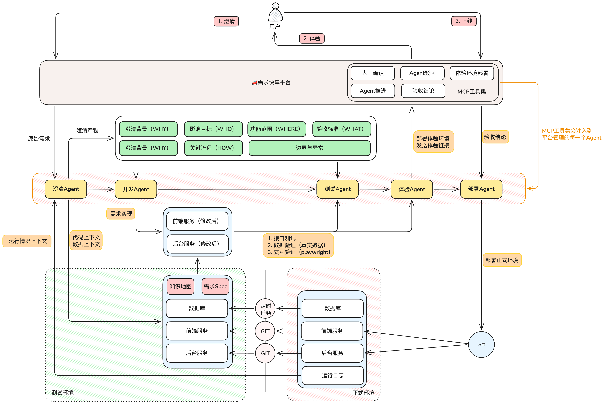
核心思想：

- 发挥内部应用技术债务低的优势，将知识地图，需求Spec，前后端代码，数据库集中在一起，尽可能为Agent提供和人类一致的完整的上下文；
- 构造真实数据的完整测试环境，让服务能在测试环境完整跑起来，为AGENT做测试验收提供条件支持；
- 平台轻量化，不直接管理AGENT，只做工具注入&提示词注入&权限管控，并为每一个需求创建沙盒环境供AGENT工作流运行；AGENT通过命令行接入，迁移成本极低(说白了, 原来用什么agent开发, 现在还用什么agent开发, 只是有人帮你把这些串起来了而已)
- AI无法处理的场合, 通过企微通知负责人人工处理, 包括但不限于AI遇到逻辑问题需要确认, AI获取不到外部系统的数据需要人来输入, AI无法进行的一些操作需要人类来辅助, 以及AI没有token了, 需要人来掏腰包

我给他取名叫需求快车平台, 寓意是这样的: 飞机毋庸置疑是交通工具中最快速的, 你可以坐着飞机从上海到深圳, 但是你没办法坐着飞机从宝山到虹桥, 以及从宝安到福田, 可恰恰这两段距离是无法避开的, 同时也占用了整趟旅程不可忽视的一段时间. 如何解决这段距离呢?叫一辆快车, 因此快车平台这个名字就这么得来了, 我希望这个平台能够真正解决我在日常工作中哪些不容易被看到但是又无法被拒绝的问题.(为什么不叫专车平台呢? 因为接单不够多, 司机等级还不够; 用的人多了会升级专车的)

言归正传, 对于需求开发而言, 第一步需求产生和最后一步验收是必须人来介入的, 因此我们需要用AI来完成中间四个步骤. 接下来对四个步骤逐一进行拆分.

## 需求评审/澄清

过去的需求澄清环节, 包含如下步骤:

- 用户提出需求, 描述需求
- 用户和开发沟通需求, 开发理解了需求以后, 开始编码; 开发如果不理解需求或者遇到需要确认的细节, 再返回去重新沟通;
- 重复1, 2两个步骤, 直到所有细节确认完毕

这个过程天生就适合被Agent替代: 用户直接和Agent沟通需求, Agent结合代码确认细节, 有问题直接在对话中提出;这样当一个需求澄清完成以后, 就代表着一份详细的实现方案也已经输出. 在对话过程中, 我们遵循一种分析问题方法的总结, 即"6W法(When Where Who What Why How)", 向用户确认如下内容:

- 澄清背景(Why)
- 现状问题(When)
- 功能范围(Where)
- 影响目标与非目标(Who)
- 关键流程如何实现(How)
- 验收标准(What)

除此之外, 再增加一条,

- 边界与异常

通过向用户确认以上七点, 再结合Agent对代码的理解, 以此来实现对需求全方位的澄清; 澄清内容后, 输出的内容需要包含以下部分:

- 需求原文
- 评审Agent在沟通过程中, 向用户确认的实现细节
- 评审Agent在理解需求内容后, 提供的实现方案

这样一套组合拳下来, 就意味着"一句话需求"的情况再也不会存在了, 哪怕你真的只有一句话, 想要需求实现, 也要被Agent由内而外拆成一套详细的PRD才行.

## 开发

开发对于研效平台来说, 不是一个很复杂的环节. 因为研效平台的主要工作量(如第一部分计算)来自于数据处理, 而数据计算本身的逻辑并不复杂, 只要明确计算逻辑, 现如今的Coding Agent已经可以很高质量地产出代码了. 所以这一阶段我们不投入太多工作量, 只需要给AI提供一套代码+数据+运行日志的测试环境, 剩下的就放手交给sol君来做.

设计之初, 我本想为项目创建一个代码地图, 因为想当然的这玩意可以帮助AI多快好省的理解项目. 但是事实确实如此吗, 本着用数据说话的精神, 我做了点微小的尝试: 在两个不同分支上做了测试, 一个分支具有通过acquire-codebase-knowledge这个SKILL生成的代码地图, 包含以下七部分:

[STACK.md](https://stack.md/) — 语言、运行时、框架以及所有依赖
[structure.md - Get in Touch](https://structure.md/)— 目录结构、入口点、关键文件
[ARCHITECTURE.md](https://architecture.md/) — 系统分层、设计模式、数据流
[CONVENTIONS.md](https://conventions.md/) — 命名规范、格式规范、错误处理、导入规范
[Integrations — The Lattice Synth | integrations.md](https://integrations.md/) — 外部 API、数据库、认证、监控
[Testing.md](https://testing.md/) — 测试框架、测试文件组织方式、Mock 策略
[CONCERNS.md](https://concerns.md/) — 技术债、已知 Bug、安全风险、性能瓶颈

另一个分支完全不具备代码地图. 然后针对两个不同的分支分别问了同样的问题, 得到以下结果:
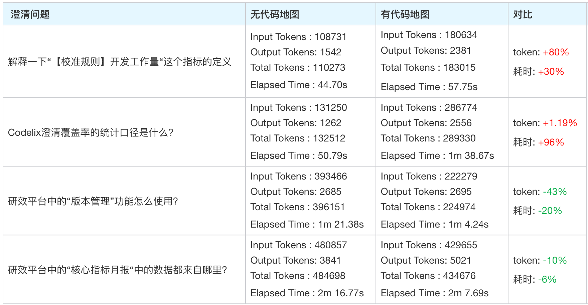

从结果来看, 在AI给出近似答案的同时, 有代码地图并没有比无代码地图的场景节约很多Token或时间, 有些场景在反而消耗了更多的Token和时间. 这一点主要是因为, 读取代码地图本身就是一个消耗Token和时间的动作, 如果给AI的提问是一个很具体, 很清晰的问题, 有很明确的关键字可以索引, 那么读取代码地图反而成为了多此一举的行为, 造成了额外的成本; 因此代码地图并非刚需, 建议只有当项目足够复杂, 或者一些逻辑坑很多, 必须提醒AI的时候才启用.

## 自测/体验

这一阶段是最重要的阶段, 一方面如上所说, 研效平台主要的开发量来自数据处理. 测试数据对Agent来说本身是很轻松的, 它们会写出各种花里胡哨的命令或者脚本来测试各种边界条件, 验证结果. 由于研效平台是面向内部的平台, 我们完全可以使用真实数据在测试环境下进行验证, 模拟增删改查的动作, 这样一来只要自测能够通过, 我们就可以认为代码能够上线运行.

所以, 我们需要提供一个能够让Agent放手测试的harness. 针对研效平台而言, 需要部署一个能够同步正式环境数据的测试环境, 在这个环境下, Agent可以放手利用真实数据来完成需求自测, 确保数据在上线之前能够达成预期. 有了这个场景以后, 原本的自测工作流就可以从: "手工同步正式环境数据库+人工验证数据"进化成: "测试数据自动同步+Agent自动验证数据准确性", 整个环节完全无需人工.

除了开发完成后的自测以外, 还存在一个场景: 校验场景(如: 为什么手算的数据和平台数据不一致? 平台的xxx数据的计算口径是什么?). 此类场景下, 提供真实数据库给Agent可以完全复现问题发生时候的代码逻辑和数据输入, 以实现精准校验.

具体措施:

- 当前研效平台正式环境的数据库部署在正式集群, 测试环境无法访问; 因此, 我们需要一台Devcloud(IDC)环境的机器, 通过定时任务定时dump正式环境的数据库, 并导入测试环境中, 让Agent能够尽可能地在真实数据的场景下开发/验证; 定时任务的时间选在了每天7:30, 12:30, 和18:30; 选择这三个时间的原因是确保在上午, 下午, 晚上三段工作时间的开始前, 能够同步到最新的数据
- 日志链路打通. Agent在排查问题的时候, 需要结合线上运行日志方能给出最精准的问题定位. 但是当前研效平台的运行日志都是存储在服务器上的, 无处读取. 对于研效平台这类运行日志数量不多的服务, 最短平快的方式是将运行日志一同落表MySQL; 这样对于Agent来说, 计算逻辑+计算结果+计算过程全都有了.

## 部署上线

以研效平台为例子, 部署上线有以下内容的变更:

● 前端服务
● 后台服务
● 数据库
● 定时任务/异步任务
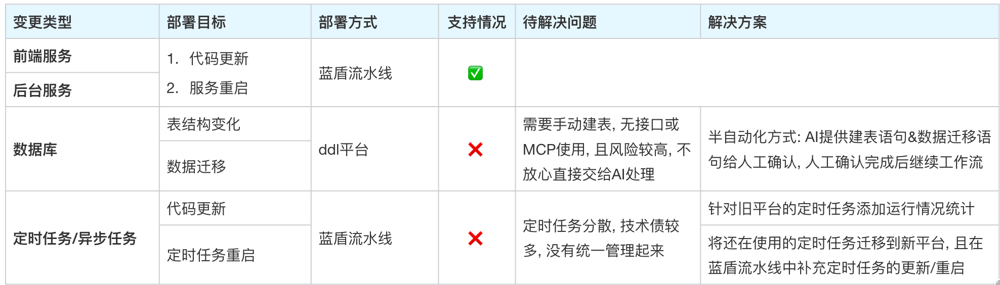

部署上线采用蓝盾+tag的形式, 一个tag触发一次代码更新+服务重启. 这里我们要确保正式环境和测试环境尽可能地统一, 对于外网大型服务来说有难度, 但是对于公司内部平台来说, 还是可以做到的.

但是涉及到数据库的变更, 当前研效平台涉及多个数据库, 且数据库均来自平台, Agent无法直接执行变更; 因此这部分变更操作当前需要人力介入

# 阶段成果

## 需求答疑

我相信你一定见过有人的企微签名挂着一个文档, 写着各种答疑内容, 期望有问题的人可以通过文档自助解决, 也许你也这么做过. 可是如果你真的这么做了, 你就会发现在这么一个匆忙的时代没人会有那个时间来自己解决自己的问题. 多数情况下你还是需要亲自出面解答问题, 如果这个问题恰好命中了你的缓存那还好, 如果没有, 你又要花时间去看代码, 看日志, 等等. 所以快车平台的第一个功能就是它: 借助完整的代码+数据+日志上下文, 接管日常的答疑工作

逻辑排查:
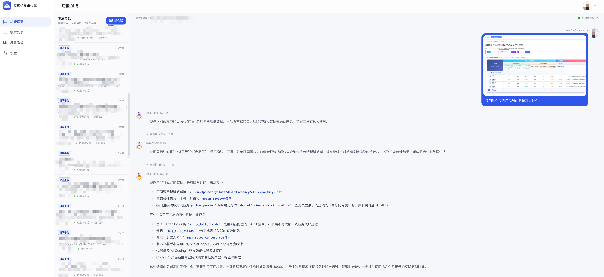
数据排查:
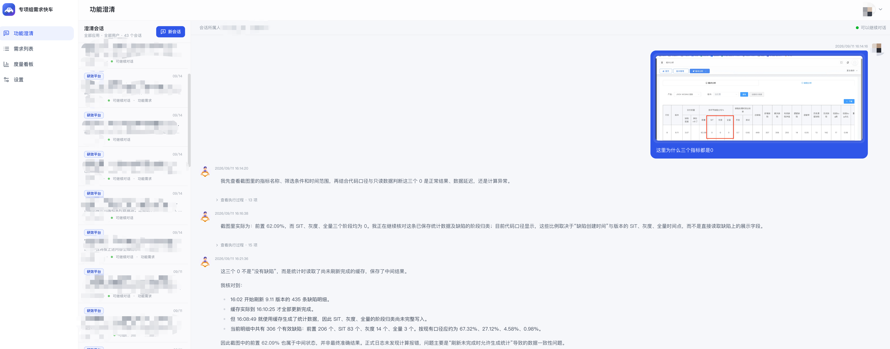## 需求澄清

有了问题以后, 往往就会产生需求, 常见的场景blackpink:

用户: "请问这里的逻辑是什么呀?"

你: "我看看"

你(二十分钟后): "这里的逻辑是xxx"

用户: "原来如此, 那这里能不能改成yyy?"

于是, 平台便支持在答疑的过程中完成需求澄清和需求提交. Agent会根据当前的代码+数据, 针对需求中存在的边界问题和逻辑问题向用户确认, 最终得到一份完整的PRD文档(再也不用担心一句话需求啦!)
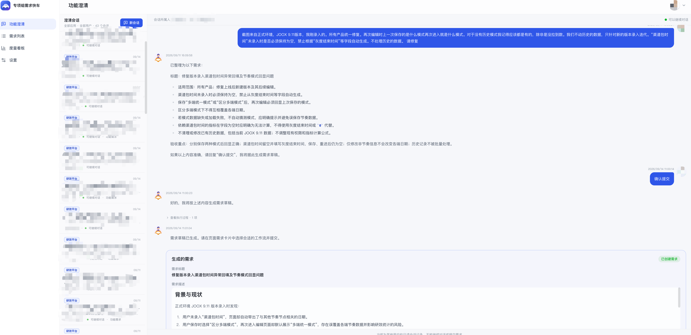
## 需求实现

有了完整的PRD, 接下来就是需求实现了. 需求实现包含三个部分: 开发+测试+体验; 整个实现过程我们会将Agent以工作流的形式展示, 其中每个Agent的输出和行为也会以列表的形式展示, 如下图所示: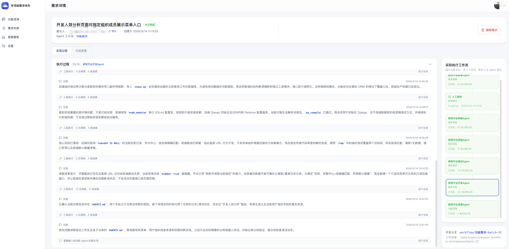
想看AI改了哪些代码, 也是可以的. 涉及多笔提交的可以合并预览:
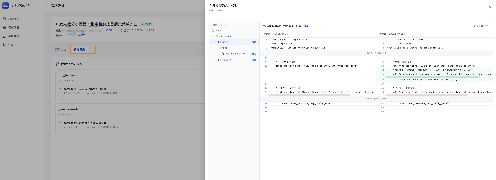
开发过程就是由Agent进行开发. 由于我早已经在研效平台的仓库中设置好了AGENTS.md和一些开发spec, 所以开发过程和我直接使用codex进行开发没有太大差别. 工作流的重点其实在于测试和体验AG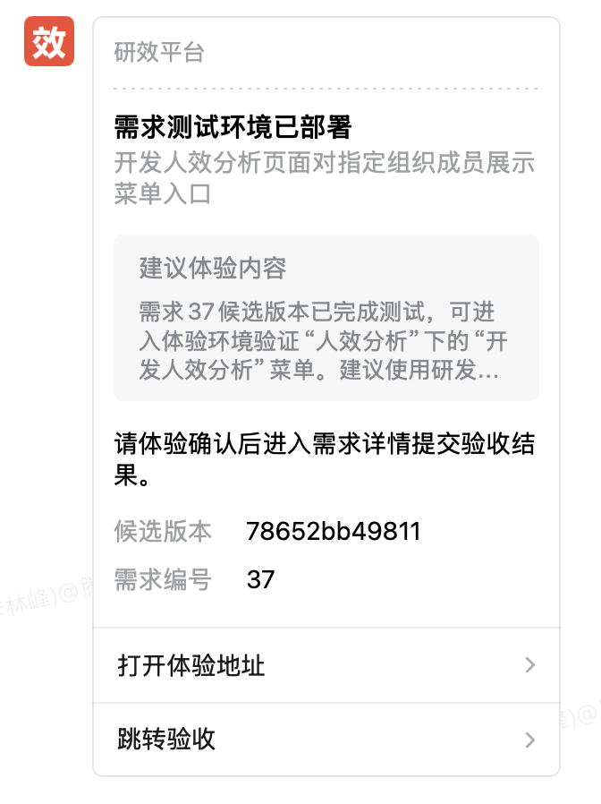
如图所示, 测试AGENT会启动一个测试环境, 在测试环境中利用从正式环境同步过来的数据, 以及澄清AGENT提供给它的验收标准来完成验收. 完成验收以后, 会将测试环境以企微机器人的方式给需求提出人发送一个体验通知, 将测试环境的链接发给需求方. 需求方即可在体验链接中体验自己的需求是否实施的到位. 体验完成后, 如果存在问题验收不通过, 则问题会重新打回给开发AGENT进行实现, 重复走开发--测试--体验这一套工作流. 如果实现没有问题, 则会交给部署AGENT来将测试环境的代码部署到正式环境上, 至此需求正式上线🥳.

## 数据收益
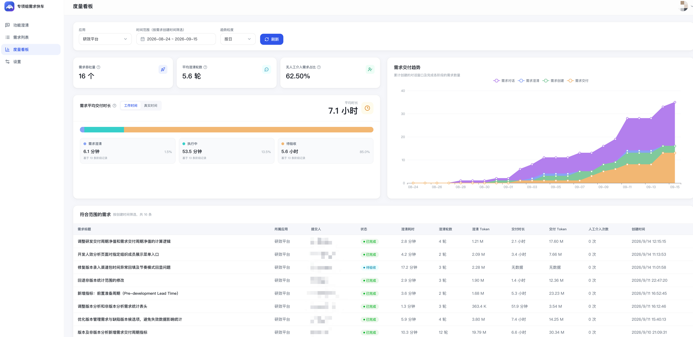
截止平台上线至今两周多的时间, 已经为研效平台交付了16个需求. 其中62.5%的需求是无人工介入的(这里的无人工介入指的是澄清完成--验收一次性通过这个过程无人介入, 毕竟澄清和验收这两个环节没有人来处理还是不行的). 按照工作时间来统计, 平均每个需求澄清耗时6.1分钟, 开发+测试耗时53.5分钟, 等待验收的时间5.6小时. 这个数据相信是符合各位程序员的体感的, 那就是开发时间早就不是限制需求交付时长的瓶颈了, 如何确保需求最终符合人的预期, 才是提高效率下一阶段要做的事.

看板中还有一个指标: 截至目前, 研效平台共有35个对话, 抛开需求澄清的对话, 有19条是用作答疑的. 光看这个数字可能没什么感知, 我换个说法: 由于这个平台的存在, 你的企业微信少了19个需要处理的@或者私聊. 这样听起来是不是更容易心动一些.

# 总结

想起来前两天看到的一段话: "现阶段为AI做的都属于脚手架, 等AI进化到拥有了这些能力后, 脚手架就只能被拆除." 在我看来, 我能通过AI完成研效平台的数据校对, 需求实现的底气是: 我已经在用Codex这么做了, 而且做的很好. 每天用户发送给我的需求, 我可以原封不动地交给Codex让它帮我查数, 帮我写代码, 然后我验证一下没问题, 就将需求交付给用户. 乍一听这很不靠谱, 但是如果我说, Codex在完成一个指标口径修改工作的过程中, **拿到了线上的运行日志从而了解到了取数的范围, 拿到了线上的数据从而获得了原始的数据, 随后按照真实的计算逻辑计算出了数据, 并且和修改前的口径进行了比较, 确定了数据无误后, 再交付了代码.**  那么还能说这个过程是不靠谱的吗? 如果人类手工实现需求, 会做这么详细的比对吗? 我持怀疑态度.

做完了这个项目以后, 我现在认为, 对于我们想用AI提效的程序员来说, 与其花费功夫在AI身上, 不如花费功夫在项目本身. 项目的架构是否清晰, 注释/文档是否全面, 运行日志是否完成, 测试环境数据是否真实, 这些东西才是决定了AI能否正确地帮助你干活的关键. 在AI的进化速度面前, 我们为AI做的那些事情简直就是在教姚明三步上篮. 

我时常想到汽车刚刚被发明的那个时代. 那个时代的人们肯定免不了"汽车能否代替马车"的讨论. 我相信在汽车诞生之初, 肯定也存在着种种问题, 也会存在一些声音认为"这东西不靠谱, 存在着这样那样的问题". 然后历史告诉了我们答案: **在巨大的生产力提升面前, 人们不会选择抛弃新工具而用回熟悉的旧工具, 而是不断迭代新工具, 直到人们彻底驾驭它, 将它变为生活中一种不可或缺的事物为止.**  AI现在就处在这么个地位, 它势必改变程序员的工作方式, 势必影响到普通人的生活, 我们不应该也无法让世界回到ChatGPT诞生之前的样子. 不断地拥抱变化, 恐怕才是这个世界唯一的生存方式.

